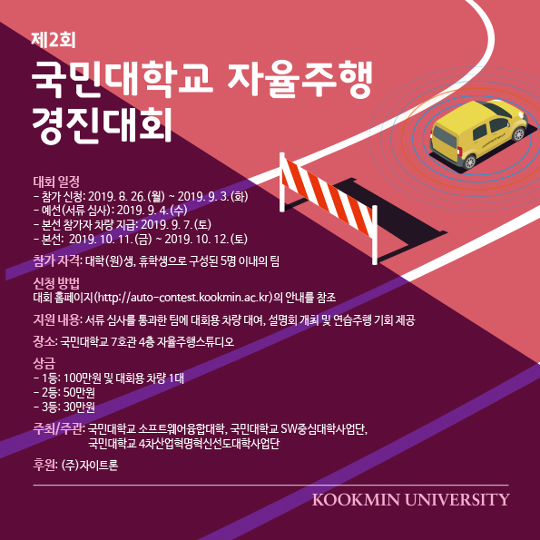

# 제2회 국민대학교 자율주행 경진대회

팀 FOSCAR의 소스코드입니다.

## 팀원
[@ganghe74](https://github.com/ganghe74), [@kyun2024](https://github.com/kyun2024), [@parkhojun](https://github.com/parkhojun), [@ShineySun](https://github.com/ShineySun), [@plmoknijb15](https://github.com/plmoknijb15)

## 브랜치
브랜치|용도
------|-------------
master | 일빈적인 상황
Fast | 고속주행
FastObstacle | 고속주행 및 장애물 간격이 좁을때
Obstacle | 일반주행 및 장애물 간격이 좁을때
UICEXPO | [산학협력 EXPO](http://uicexpo.org) 시연용
